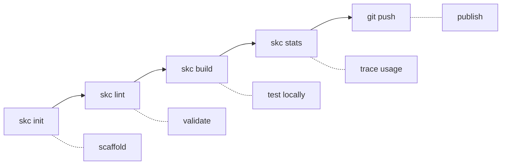
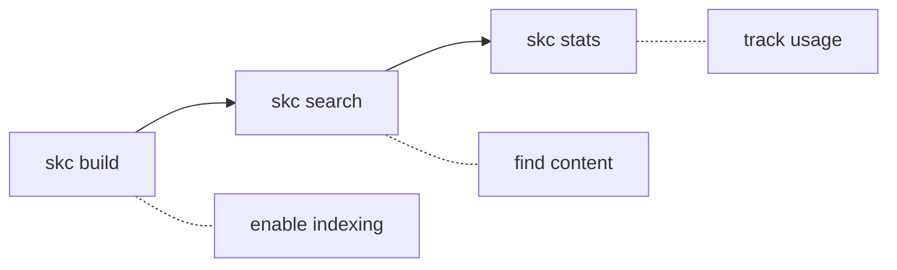

# skillc

[](https://github.com/govctl-org/skillc/actions/workflows/ci.yml)
[](https://codecov.io/gh/govctl-org/skillc)
[](https://crates.io/crates/skillc)
[](https://github.com/govctl-org/govctl)

**The development kit for [Agent Skills](https://agentskills.io/)** — create, validate, and optimize skills that extend AI agent capabilities.

## Who is this for?

### Skill Authors

Create, validate, and test skills locally before publishing with confidence:



### Power Users

Compile any skill to unlock full-text search and usage analytics:



> **Note:** `skc build` is optional for consumers. Published skills work without compilation — building just enables search and analytics.

## Installation

```bash
cargo install skillc
```

## Quick Start

**For skill authors:**

```bash
skc init my-skill           # Create a new skill
# ... edit SKILL.md ...
skc lint my-skill           # Validate quality
skc build my-skill          # Build for local testing
skc stats my-skill          # See how agents use your skill
git push origin main        # Publish to GitHub
```

**For power users:**

```bash
npx skills add user/skill   # Install a skill
skc build user-skill        # Enable search + analytics
skc search user-skill "api" # Full-text search
skc stats user-skill        # Usage insights
```

## Commands

| Category      | Command       | Description                    |
| ------------- | ------------- | ------------------------------ |
| **Author**    | `skc init`    | Create new skill or project    |
|               | `skc lint`    | Validate structure and quality |
|               | `skc build`   | Compile and deploy locally     |
|               | `skc list`    | List all managed skills        |
| **Read**      | `skc outline` | List all sections              |
|               | `skc show`    | Show section content           |
|               | `skc open`    | Read file contents             |
|               | `skc search`  | Full-text search               |
|               | `skc sources` | List source files              |
| **Analytics** | `skc stats`   | Usage analytics                |
|               | `skc sync`    | Merge local logs               |
| **Agent**     | `skc mcp`     | Start MCP server               |

<details>
<summary><strong>Command examples</strong></summary>

```bash
# Authoring
skc init my-skill --global          # Create in ~/.skillc/skills/
skc lint my-skill                   # Check for issues
skc build my-skill --target cursor  # Deploy to Cursor

# Reading (also available as MCP tools)
skc outline my-skill                # List all headings
skc outline my-skill --level 2      # Only # and ## headings
skc show my-skill --section "API Reference"
skc show my-skill --section "API" --max-lines 50  # Truncate output
skc open my-skill SKILL.md --max-lines 100        # Read first 100 lines
skc search my-skill "borrow checker"
skc sources my-skill --pattern "*.md"

# Analytics
skc stats my-skill --group-by sections
skc stats my-skill --group-by search  # Most frequent search terms
skc sync --dry-run
```

</details>

## What is an Agent Skill?

A directory with a `SKILL.md` file:

```
my-skill/
├── SKILL.md          # Required: metadata + instructions
└── docs/             # Optional: additional content
    ├── reference.md
    └── examples.md
```

The `SKILL.md` has YAML frontmatter:

```markdown
---
name: my-skill
description: A skill that does something useful
---

# My Skill

Instructions for the agent...
```

See [agentskills.io](https://agentskills.io/) for the full specification.

## MCP Integration

skillc exposes all read commands as MCP tools for direct agent integration:

```bash
skc mcp  # Start the MCP server
```

Add to your agent's MCP configuration to enable tools like `skc_outline`, `skc_show`, `skc_search`.

## Storage

| Path                | Purpose                   |
| ------------------- | ------------------------- |
| `.skillc/skills/`   | Project-local skills      |
| `~/.skillc/skills/` | Global source store       |
| `~/.claude/skills/` | Claude runtime (deployed) |
| `~/.cursor/skills/` | Cursor runtime (deployed) |

## Development

```bash
just test    # Run tests
just cov     # Coverage report
just lint    # Clippy
just fmt     # Format
```

## License

MIT OR Apache-2.0
